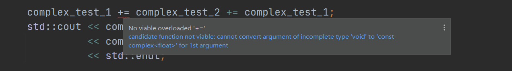

## 一. pass by value vs pass by conference

​		C++引用传值相当于是传的变量的地址，地址在32位编译器中占4字节空间，64位空间中占8字节空间。一般来说，大部分数据所占用的空间都会比这个大，因此侯捷老师在课中推荐大部分情况下传值能采用引用就采用引用，返回值也尽量用引用传。

​	注意：返回值传递引用时，这个返回值应该是本来就存在的，即不是临时定义创建的。	

​	但是，如果考虑的细致一点，如果传递的是一些占用空间小的数据如一个char字符，那么可以考虑使用直接传值。

​		另外传值时担心原数据被修改可以加上const关键词进行限定。

| 类型          | 32  | 64  |
| ------------- | --- | --- |
| char          | 1   | 1   |
| short int     | 2   | 2   |
| int           | 4   | 4   |
| long int      | 4   | 8   |
| long long int | 8   | 8   |
| char*         | 4   | 8   |
| float         | 4   | 4   |
| double        | 8   | 8   |


## 二 . 同一class的各个objects互为友元

​		定义了两个同一类型的不同对象，不同对象却可以通过方法来访问彼此的私有数据，很多程序员知道可以这样做，但无法合理解释，侯捷老师提出的一个解释是：同一class的各个objects互为友元。

​		我猜想，以前学过同一类型的数据各个对象都不一样，但方法只有一套，而私有的数据面对方法是开放的，无论是对象一还是对象二都是使用的同一套方法，即它们调用的方法是同一批，而它们的数据都对这些方法开放。因此，即使是不同的对象，但因为是使用的同一批方法，所以可以通过这些方法来访问彼此的数据。


## 三. const限定

​		类定义里需要const限定一定const。


## 四. 构造函数

​		构造函数尽量使用初始化，而非赋值。


## 五.  构造函数被放在private里的情况


## 六. 传递者无需知道接收者是以何种形式接收


## 七. +=计算符的返回值类型的影响

```c++
template<typename U>
inline complex<U>& _doapl(complex<U>* ths, const complex<U>& r) {
    ths->real_ += r.real_;
    ths->image_ += r.image_;

    return *ths;
}

template<typename T>
inline complex<T>& complex<T>::operator+=(const complex<T>& r) {

    return _doapl(this, r);
}
```

​		在上述代码中实现了一个complex类的+=符号重载，operator+=作为类的成员函数，除了传入的参数r外，还有一个隐藏的参数this指针，调用_doapl函数时传递了this指针进去。并且可以看到在__doapl函数中完成+=与运算后值是直接赋予this指针的，及A+=B时，最后的结果已经保存在了A里面，因此，此时无论operator+=的返回值是什么都无所谓，可以是void。

​		但是，如果出现连续使用的情况，如：A+=B+=A；那么先进行的是B+=A的运算，之后，在进行A与B+=A这个表达式的运算，如果operator的返回值为void，那么第一个就没有计算对象，编译器就会报错，因为没有定义其他类型与void类型的运算。如图：

```c++
inline void/*complex<T>&*/ complex<T>::operator+=(const complex<T>& r) {

    return _doapl(this, r);
```



编译时报错如下：

```shell
[ 50%] Building CXX object CMakeFiles/test.dir/sources/test.cpp.obj
D:\Documents\my_projects\cmake_projects\C++_Primer_5th\sources\test.cpp: In function 'int main()':
D:\Documents\my_projects\cmake_projects\C++_Primer_5th\sources\test.cpp:17:20: error: no match for 'operator+=' (operand types are 'complex<float>' and 'void')
     complex_test_1 += complex_test_2 += complex_test_1;
     ~~~~~~~~~~~~~~~^~~~~~~~~~~~~~~~~~~~~~~~~~~~~~~~~~~
In file included from D:\Documents\my_projects\cmake_projects\C++_Primer_5th\sources\test.cpp:4:0:
D:/Documents/my_projects/cmake_projects/C++_Primer_5th/headers/complex.hpp:36:28: note: candidate: void complex<T>::operator+=(const complex<T>&) [with T = float]
 inline void/*complex<T>&*/ complex<T>::operator+=(const complex<T>& r) {
                            ^~~~~~~~~~
D:/Documents/my_projects/cmake_projects/C++_Primer_5th/headers/complex.hpp:36:28: note:   no known conversion for argument 1 from 'void' to 'const complex<float>&'
D:/Documents/my_projects/cmake_projects/C++_Primer_5th/headers/complex.hpp: In instantiation of 'void complex<T>::operator+=(const complex<T>&) [with T = float]':
D:\Documents\my_projects\cmake_projects\C++_Primer_5th\sources\test.cpp:17:41:   required from here
D:/Documents/my_projects/cmake_projects/C++_Primer_5th/headers/complex.hpp:38:26: error: return-statement with a value, in function returning 'void' [-fpermissive]
     return _doapl(this, r);
                          ^
mingw32-make.exe[3]: *** [CMakeFiles\test.dir\build.make:82: CMakeFiles/test.dir/sources/test.cpp.obj] Error 1
mingw32-make.exe[2]: *** [CMakeFiles\Makefile2:182: CMakeFiles/test.dir/all] Error 2
mingw32-make.exe[1]: *** [CMakeFiles\Makefile2:189: CMakeFiles/test.dir/rule] Error 2
mingw32-make.exe: *** [Makefile:176: test] Error 2

```

## 八 . 检测自我赋值（self assignment）

```c++
String &String::operator=(const String &str) {
  //!检测自我赋值(self assignment)
  if (this == &str)
    return *this;

  delete[] this->m_data_;
  this->m_data_ = new char [strlen(str.m_data_) + 1];
  strcpy(this->m_data_, str.m_data_);

  return *this;
}
```

​		在这段代码中，如果去掉if那一段，并且传进来来了这个字符串本身，那么将发生自我赋值，及我把我自己赋值给自己；但是我们看一下后面的代码，首先会delete[] this->m_data_，自己被释放掉了，那么后果就是，我原来本身的数据也就丢失了；因此为了避免这一情况，可以先判断是否为自我赋值，如果是直接返回本身即可。

## 九. array new 配合 array delete