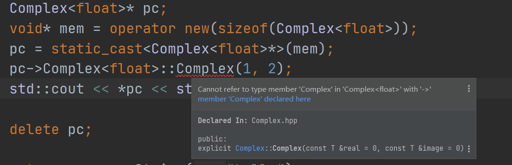

## 一. new的拆分实现

​		今天看侯捷老师讲解new的实现过程时，举了一个例子："Complex<float>* pc = new Complex(1,2);"可以等效为如下代码：

```c++
  Complex<float>* pc;
  void* mem = operator new(sizeof(Complex<float>));
  pc = static_cast<Complex<float>*>(mem);
  pc->Complex<float>::Complex(1, 2);
```

​		这段代码再MSVC环境下可顺利编译通过并且可以同重载后的流运算符''<<"std::cout出来;但是在MGingw64和Ubuntu下就无法编译通过，静态检测也会报错，静态检测报错如下：



编译时报错如下：

```bash
D:\Documents\my_projects\cmake_projects\my_basic_data_structure\sources\test.cpp: In function 'int main()':
D:\Documents\my_projects\cmake_projects\my_basic_data_structure\sources\test.cpp:26:23: error: cannot call constructor 'Complex<float>::Complex' directly
   pc->Complex<float>::Complex(1, 2);
                       ^~~~~~~
mingw32-make.exe[3]: *** [CMakeFiles\test.dir\build.make:82: CMakeFiles/test.dir/sources/test.cpp.obj] Error 1
mingw32-make.exe[2]: *** [CMakeFiles\Makefile2:95: CMakeFiles/test.dir/all] Error 2
mingw32-make.exe[1]: *** [CMakeFiles\Makefile2:102: CMakeFiles/test.dir/rule] Error 2
mingw32-make.exe: *** [Makefile:137: test] Error 2

```

​		并且在尝试过程中发现，MSVC似乎对构造函数的重复使用比较宽容，即使我已经构造出了一个对象，我通过这个对象重新调用构造函数也不会报错，虽然没有效果，但不影响其余部分的正常运行，而MGingw64似乎就严厉得多，直接编译不通过。

​		根据上述现象我猜测是MGinw64认为那个构造函数是重复调用的，即这个对象已经被构造出来了，不能再构造，只能通过其他接口函数来修改它的内部参数值。但是为什么MSVC就可以编译通过并构造成功呢?莫非在MSVC看来前面并不能算是构造？这一段均为自己的猜想，我并不确定真正的情况是怎么样的。